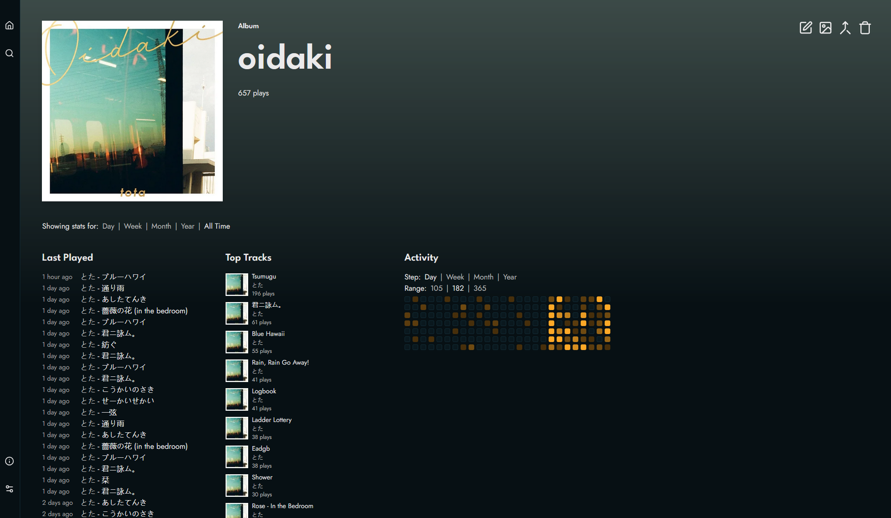

# Koito

Koito is a modern, themeable, ListenBrainz-compatible scrobbler that I created because I am a data-addicted self-hoster that wanted something 
a little bit better than what is currently available for my listening habits.

> This project is currently pre-release, and therefore you can expect bugs for the time being. If you don't want to replace your current scrobbler
with Koito quite yet, you can [set up a relay](https://koito.io/guides/scrobbler/#set-up-a-relay) from Koito to another ListenBrainz-compatible
scrobbler. This is what I've been doing for the entire development of this app and it hasn't failed me once. Or, you can always use something
like [multi-scrobbler](https://github.com/FoxxMD/multi-scrobbler).

## Screenshots





## Installation

See the [installation guide](https://koito.io/guides/installation/), or, if you just want to cut to the chase, use this docker compose file:

```yaml
services:
  koito:
    image: gabehf/koito:latest
    container_name: koito
    depends_on:
      - db
    user: 1000:1000
    environment:
      - KOITO_DATABASE_URL=postgres://postgres:secret_password@db:5432/koitodb
      - KOITO_ALLOWED_HOSTS=koito.example.com,192.168.0.100
    ports:
      - "4110:4110"
    volumes:
      - ./koito-data:/etc/koito
    restart: unless-stopped

  db:
    image: postgres:16
    container_name: psql
    restart: unless-stopped
    environment:
      POSTGRES_DB: koitodb
      POSTGRES_USER: postgres
      POSTGRES_PASSWORD: secret_password
    volumes:
      - ./db-data:/var/lib/postgresql/data
```

Be sure to replace `secret_password` with a random password of your choice, and set `KOITO_ALLOWED_HOSTS` to include the domain name or IP address you will be accessing Koito 
from when using either of the Docker methods described above.

## Importing Data

See the [data importing guide](https://koito.io/guides/importing/) in the docs.

## Full list of configuration options

See the [configuration reference](https://koito.io/reference/configuration/) in the docs.