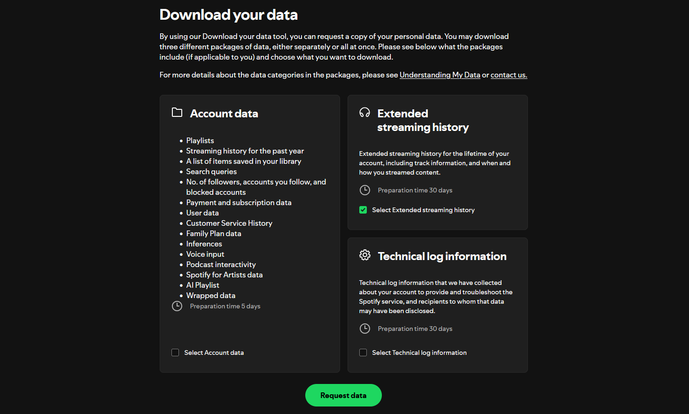

Koito currently supports two sources to import data from: **Spotify** and **Maloja**.

## Spotify

To get your data from Spotify, you first need to request your extended streaming history from [the Spotify privacy page](https://www.spotify.com/us/account/privacy/). 
The export could take up to 30 days, according to Spotify. Then, all you have to do is put the `.json` files from your data export into the
`import` folder in your config directory, and restart Koito. The data import will then start automatically.

Koito relies on file names to find files to import. If the files aren't being imported automatically, make sure they contain `Streaming_History_Audio` in the file name.

## Maloja

You can download your data from Maloja by clicking the `Export` button under Download Data on the `/admin_overview` page of your Maloja instance. Then,
put the resuling `.json` file into the `import` folder in your config directory, and restart Koito. The data import will then start automatically.

Koito relies on file names to find files to import. If the files aren't being imported automatically, make sure they contain `maloja` in the file name.

:::note
Maloja may have missing or inconsistent track duration information, which means that the 'Hours Listened' statistic may be incorrect after a Maloja import. However, track
durations will be filled in as you submit listens using the API.
:::